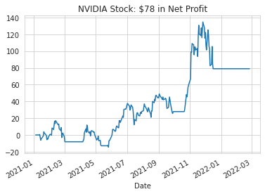
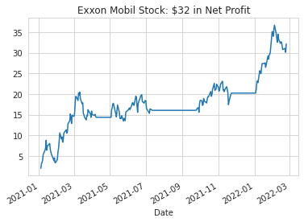

# Stocks Trading Strategies & Financial Analysis

### Description and methodology

In this project, we will conduct a macro and micro analysis of daily stock data from the beginning of 2019 up to February 2022 to analyze the behavior and movement of stocks and other financial assets over time. In addition to implementing and testing the fast and slow signals trading strategy to aid traders in buying and selling decisions.

We will start at the micro-level by analyzing the overall behavior of our candidate stocks by plotting their daily closing price, daily volume, and log returns. Next, we will calculate and plot the 7-day and 40-day moving average to conduct the Fast & Slow Signals Trading Strategy. We will report the net accumulated profit/loss by following this strategy using past periods as a testing sample.

Afterward, we will calculate the Value at Risk (VaR) to quantify the extent of possible daily financial loss in selected stocks, as investment professionals and portfolio managers commonly use this metric to determine the size and probabilities of potential losses in their institutional portfolios.

Then, moving to the macro analysis part, we will conduct a thorough time series analysis of the relationship between our candidate stocks and macro-variables; in this model, we chose to analyze the relationship with Brent Oil Prices and S&P500. This part will help investors test and understand our candidate stock's relative movements regarding changes in business cycles and the macroeconomy.
In this part, we'll start by doing fundamental statistic analysis and visualization of before & after the pandemic, then we'll analyze the effect of changes in oil prices and S&P500 on selected stocks. To do so, we plot the ACF & PACF to help in model selection. After the regression, we use the augmented Dicky-Fuller test to check for unit roots and cointegration.


### Data sets

In this analysis, we used daily data for stocks from ["Yahoo Finance"](https://finance.yahoo.com/quote/TSLA/history?p=TSLA) and daily macro-variables data (Oil Prices and S&P500) from ["FRED"](https://fred.stlouisfed.org/series/DCOILBRENTEU) for the period starting from January 2019 up to February 2022.

### Reproducibility

You use this code to test this trading strategy and produce similar micro & macro analysis and visualization, using any stock or macro-variable that comes to mind.

**To do so:**


1. First, download your candidate stock daily data of the pre-defined period from ["Yahoo Finance"](https://finance.yahoo.com/quote/TSLA/history?p=TSLA) 
2. Next, download your daily macro-variable data of the pre-defined period from 
    ["FRED"](https://fred.stlouisfed.org/series/DCOILBRENTEU)
3. Make sure to change variable names in the code to match the new data sets file names.
4. Note that you must choose the type of ARIMA model selected in the regression based on the ACF & PACF plots.
5. Install required libraries before running the code by typing the following command in your terminal, ```Python
pip install -r requirements.txt```
5. You can run ```Python jupyter nbconvert --to markdown --execute jubyter-notebook.ipynb``` to export your output to a markdown file.


### Project findings and analysis

In this project, we selected three stocks to conduct our analysis on:
1. Tesla
2. Nvidia
3. Exxon mobil
Also, we selected two macro-variables to test the effect of their movements on our selected stocks:
1. Brent Oil prices
2. S&P 500


We started by analysing the general behaviour of those stocks where we found out that  Tesla and NVIDIA exhibited an upward trend, while Exxon Mobil were not showing any obvious trend.

    

    


    

    


    


Then by implementing the fast and slow trading startegy, we saw that Tesla has accumilated the largest amount of profits of 281$ per share compared to, 78 and 32 dollars per share for Nvidia and Exxon Mobil respectively.


VAR for Tesla

    5% quantile  -0.06653962651049658
    95% quantile  0.07301154681305047
    25% quantile  -0.025376262387034748
    75% quantile  0.03184818268958867
    
VAR for NVIDIA
    
    5% quantile  -0.04860526906430513
    95% quantile  0.053540237453345546
    25% quantile  -0.01847544229020068
    75% quantile  0.02341041067924111
    
VAR for Exxon Mobil

    5% quantile  -0.037681040759660736
    95% quantile  0.037959626458253515
    25% quantile  -0.015369337797380932
    75% quantile  0.01564792349597372
    


Then by estimating the Value at Risk (VarR), we can see that, the 5% quantile for tesla is (-0.0665), which means, there is a 5% chance that, the daily return is worse than negative 6.65%.


By moving to the macro trend analysis. W
e started by doing fundamental statistic analysis and visualization of before & after the pandemic, we can see that crude oil prices fluctuated before the epidemic, and then fell rapidly. After the epidemic, until the end of May 2020, it began to rise continuously, while the S&P500 rose steadily before the pandemic, but then drop rapidly until May 2020, and then continued to rise. 


Next, we did a regression analysis to test the relationships between the selected stocks and Oil prices and S&P500.
After plotting the ACF and PACF we selected ARIMA (3,0,3) model to conduct our regression. Then we used  augmented Dicky-Fuller test to check for unit-roots.

According to the results, there indeed exists a unit root, or we can’t reject the null hypothesis. Thus, we concluded that the growth rate of NVDA and TSLA's stock price, oil price, SP500 are cointegrated.

We also found an interesting thing: the growth rate of the stock has a noticeable lagged reflection to that of oil prices and SP500, since we can clearly see that the coefficients in the second-order, third order, fourth-order are much higher and statistically significant than first order, we can estimate the growth rate of stock price need some time to make any adjustment.


### Limitations and room for improvements 

Stock markets are affected by many factors, and it is almost impossible to always get an accurate prediction. Even though, the trading techniques we used worked with all the three stocks we picked randomly, and are very likely to work for others, they are not guaranteed to succeed in all the stocks. There are many other trading strategies traders might use to complement these tools to produce more accurate results, but still nothing is guaranteed in the stock market.

